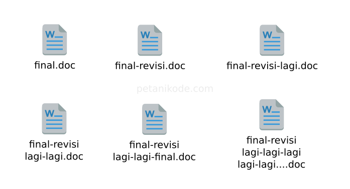
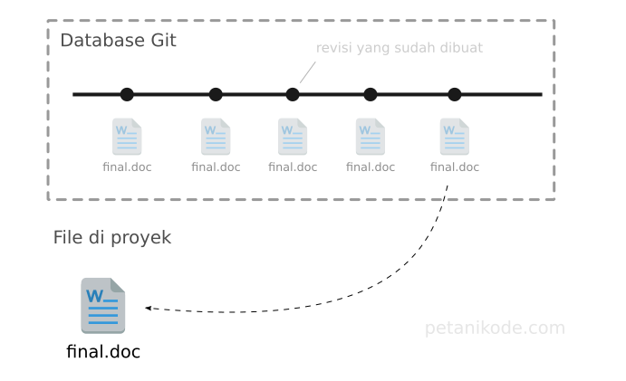
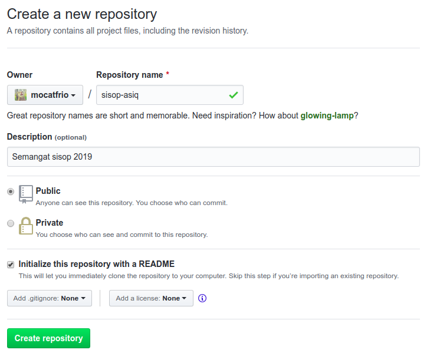
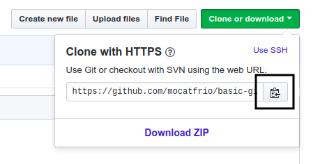
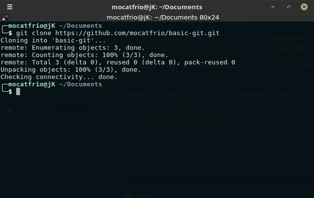
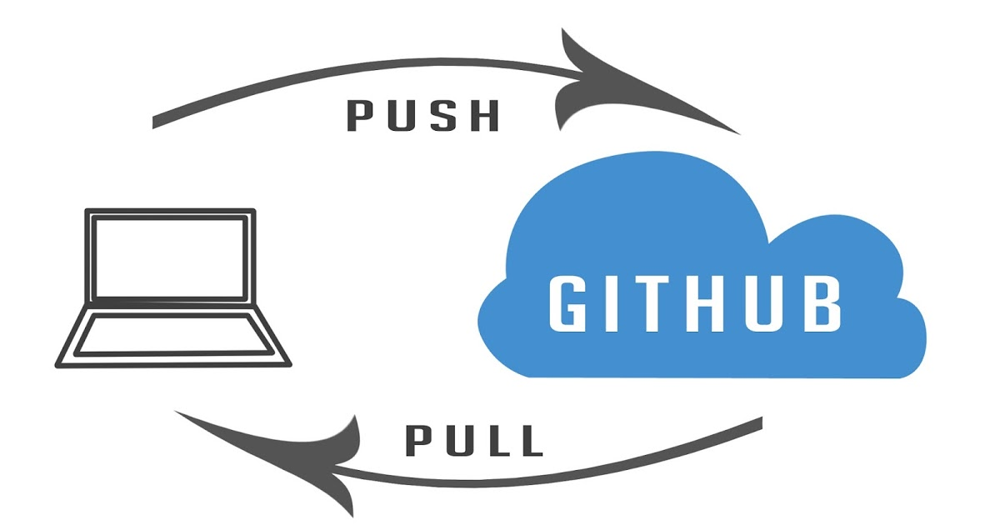
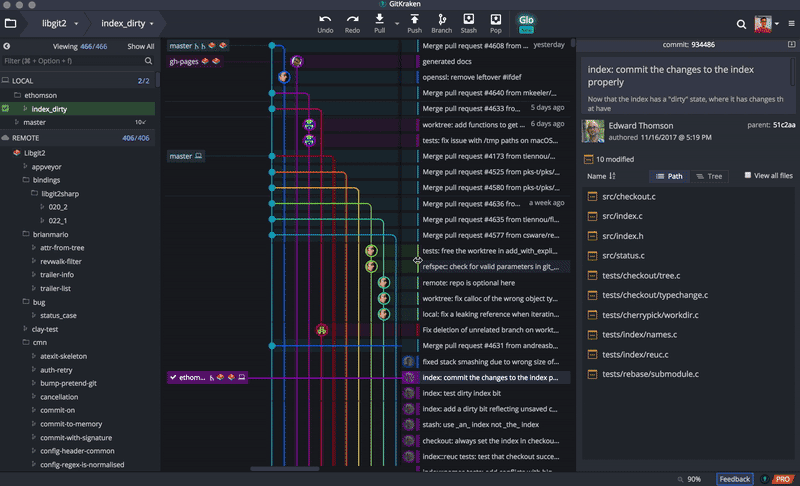
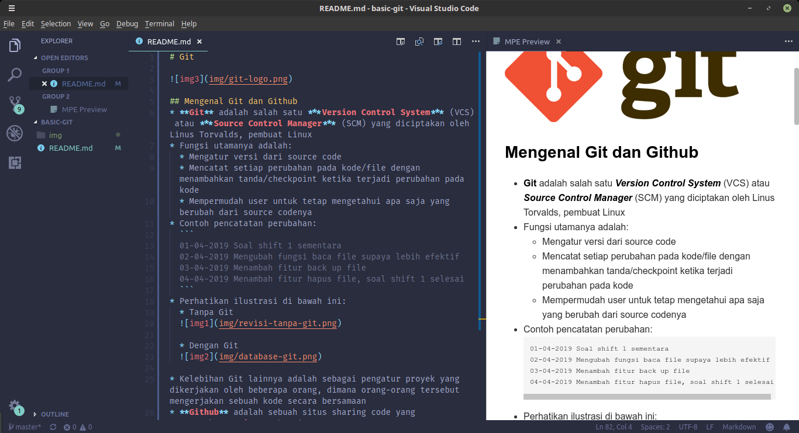

# Git


## Mengenal Git dan Github
* **Git** adalah salah satu ***Version Control System*** (VCS) atau ***Source Control Manager*** (SCM) yang diciptakan oleh Linus Torvalds, pembuat Linux
* Fungsi utamanya adalah:
  * Mengatur versi dari source code
  * Mencatat setiap perubahan pada kode/file dengan menambahkan tanda/checkpoint ketika terjadi perubahan pada kode 
  * Mempermudah user untuk tetap mengetahui apa saja yang berubah dari source codenya
* Contoh pencatatan perubahan:
  ```
  01-04-2019 Soal shift 1 sementara
  02-04-2019 Mengubah fungsi baca file supaya lebih efektif
  03-04-2019 Menambah fitur back up file
  04-04-2019 Menambah fitur hapus file, soal shift 1 selesai
  ```
* Perhatikan ilustrasi di bawah ini:
  * Tanpa Git
  

  * Dengan Git
  

* Kelebihan Git lainnya adalah sebagai pengatur proyek yang dikerjakan oleh beberapa orang, dimana orang-orang tersebut mengerjakan sebuah kode secara bersamaan
* **Github** adalah sebuah situs sharing code yang menggunakan **Git** sebagai SCM-nya. 

## Beberapa Istilah Penting dalam Git
1. Repository
2. Clone
3. 

## Instalasi
Jika kamu menggunakan Linux berbasis Debian/Ubuntu, lakukan ini:
```bash
sudo apt-get update
sudo apt-get install git
```
Kemudian cek
```bash
git --version
```

## Bermain dengan Git dan Github
1. Buat akun di https://github.com/
2. Buat repository baru di akun Github kamu
   
   

3. Sekarang buka terminal di PCmu, kita akan bermain Git menggunakan CLI
4. Setting Git terlebih dahulu
    ```bash
    git config --global user.name "<username>"
    git config --global user.email "<email@example.com>"
    ```
    p.s. Ubah <username> dan <email> sesuai akun Github yang sudah dibuat
5. Buka repository yang telah kamu buat tadi di Github, kemudian copy link untuk melakukan clone
   
   

6. **Clone** repository tersebut
    ```bash
    git clone https://github.com/mocatfrio/basic-git.git
    ```

    

7. Pindah ke folder yang telah terbuat otomatis dari hasil cloning
    ```bash
    cd basic-git
    ```
8. Lakukan modifikasi sesukamu pada source code/file. Kemudian coba cek status Git 
    ```bash
    git status
    ```
    Maka, akan keluar tampilan seperti ini:
    ```bash
    On branch master
    Your branch is up-to-date with 'origin/master'.
    Changes not staged for commit:
      (use "git add <file>..." to update what will be committed)
      (use "git checkout -- <file>..." to discard changes in working directory)

      modified:   README.md

    Untracked files:
      (use "git add <file>..." to include in what will be committed)

      img/

    no changes added to commit (use "git add" and/or "git commit -a")
    ```
    p.s.
    * **modified** artinya file yang sudah ada dan sedang dimodifikasi
    * **Untracked files** artinya file yang baru ditambahkan (sebelumnya tidak ada)
9.  Tambahkan semua perubahan di atas (baik file yang baru maupun yang dimodifikasi) dengan melakukan **Add**
    ```bash
    git add -A
    ```
    p.s. `-A` artinya tambahkan semua file yang berubah, sehingga file yang tidak berubah, tidak akan ditambahkan

    Setelah melakukan add, coba cek kembali status git. Maka akan keluar seperti ini:
    ```bash
    $ git status
    On branch master
    Your branch is up-to-date with 'origin/master'.
    Changes to be committed:
      (use "git reset HEAD <file>..." to unstage)

      modified:   README.md
      new file:   img/1.png
      new file:   img/database-git.png
      new file:   img/git-logo.png
      new file:   img/gitkraken.gif
      new file:   img/revisi-tanpa-git.png
      new file:   img/ss1.png
      new file:   img/ss2.png
      new file:   img/ss3.png
      new file:   img/ss4.png
    ```
10. Selanjutnya, lakukan **Commit** pada file yang telah ditambahkan
    ```bash
    git commit -m "<masukkan pesan yang berfaedah yha>"
    ```
    p.s.
    * `-m` digunakan untuk memasukkan pesan commit. Usahakan pesannya jelas dan mudah dipahami, supaya bisa digunakan untuk mencari suatu perubahan
    * Contoh pesan yang baik
        ```bash
        git commit -m "mengubah fungsi baca file"
        git commit -m "menghapus fitur md5"
        git commit -m "menambah fitur hapus file setelah 5 detik"
        ```
    * Contoh pesan yang buruk
        ```bash
        git commit -m "duh capeq sekali yha"
        git commit -m "uhuy selesai tugasku"
        git commit -m "revisi"
        git commit -m "revisi terakhir bgt"
        ```
    
    Setelah di commit, maka akan keluar pesan seperti ini:
    ```bash
    [master b0b9dc8] uhuy
    10 files changed, 144 insertions(+), 2 deletions(-)
    rewrite README.md (100%)
    create mode 100644 img/1.png
    create mode 100644 img/database-git.png
    create mode 100644 img/git-logo.png
    create mode 100644 img/gitkraken.gif
    create mode 100644 img/revisi-tanpa-git.png
    create mode 100644 img/ss1.png
    create mode 100644 img/ss2.png
    create mode 100644 img/ss3.png
    create mode 100644 img/ss4.png
    ```
11. Terakhir, melakukan **Push**. Mudahnya, push ini untuk mengunggah file yang telah dimodifikasi di repository lokal (PC)
    ```bash
    git push
    ```
    Kamu akan diminta memasukkan username dan password akun Github. Jika berhasil, maka akan mengeluarkan output seperti ini:
    ```bash
    Counting objects: 13, done.
    Delta compression using up to 4 threads.
    Compressing objects: 100% (13/13), done.
    Writing objects: 100% (13/13), 2.55 MiB | 34.00 KiB/s, done.
    Total 13 (delta 0), reused 0 (delta 0)
    To https://github.com/mocatfrio/basic-git.git
      862a012..b0b9dc8  master -> master
    ```
11. Ada suatu ketika, teman kamu mengedit source code yang juga sedang kamu kerjakan. Maka kamu harus melakukan **Pull** untuk menyamakan source code yang sudah diedit temanmu dengan source code di PCmu. Mudahnya, pull ini untuk mengunduh file.
    ```bash
    git pull
    ```




## Tips
1. Untuk kamu yang tidak terbiasa dengan terminal, ada banyak sekali aplikasi Git Client yang tersedia, fitur yang ditawarkan pun beragam. Berikut ini salah satu contoh aplikasi Git Client berbasis GUI yang paling sering digunakan:

   * [GitKraken](https://www.gitkraken.com/)
     
      

   * [SourceTree](http://www.sourcetreeapp.com/)
   * [SmartGit](http://www.syntevo.com/smartgithg/)

2. Untuk menulis **Markdown (.md)** supaya lebih rapi dan menyenangkan, kamu bisa menggunakan tools **Visual Studio Code** dan menginstal beberapa Ekstensi (Ctrl+Shift+X), salah satunya adalah **Markdown Preview Enhanced**. Ekstensi ini berguna untuk memberikan preview dari markdown yang sedang ditulis.
   
    

    Markdown cheatsheet: https://www.markdownguide.org/cheat-sheet/


## Referensi
